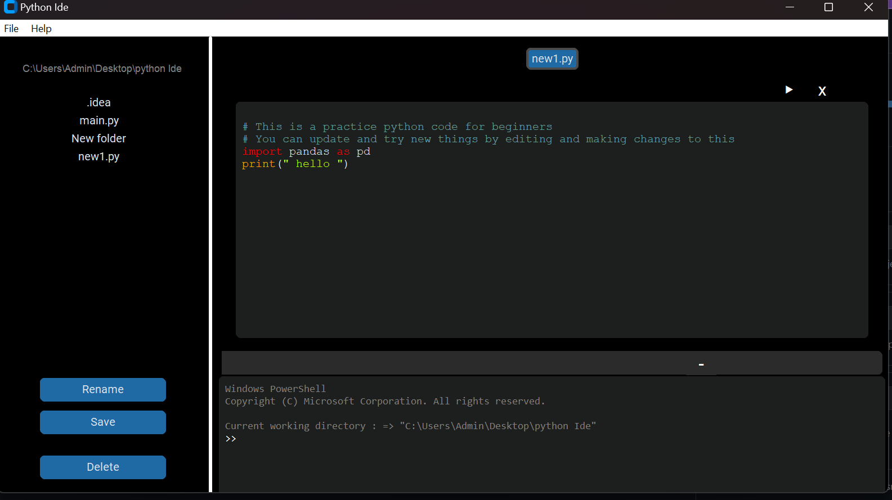

# Python_IDE

## Introduction

## Short-cut Keys

 
  -> "<b>Ctrl + S</b>" Save 
  -> "<b>Ctrl + N</b>" 
  -> "<b>Ctrl + O</b>" 
  -> "<b>Ctrl + F</b>" 
  -> "<b>Ctrl + W</b>" 
  -> "<b>Shift + F10</b>" 
  -> "<b>Ctrl + Space</b>" 

## Pre-View

  

